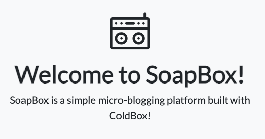

# ColdBox From Zero to Hero (CBOX-120)

In this workshop you will be introduced to the latest version of the most popular CFML MVC framework; ColdBox 7. We will go over the basics of installation, templating and configuration to the most advanced features like HMVC development with modules, RESTFul APIs, interception points, integratino testing and much more.

## Prerequisites

- Latest CommandBox CLI
- A local database server (MySql 8 is recommended)
- Basic to Intermediate ColdFusion (CFML) Knowledge

## Software Versions

This course at this time is using the following dependencies:

- ColdBox 7.x
- CBSecurity 3.x
- CBDebugger 4.x
- CommandBox Migrations 4.x

**There could be the case that some of the steps fail if you are using future versions of these modules.  Please update accordingly or look for the specific updated version of this course as a branch.**

## Course Outline

This course will focus on building a real twitter clone; SoapBox, based on different concepts and tool methodologies. We will use ColdBox features, including Behavior Driven Development (BDD) testing and leveraging several ForgeBox modules.

> (All commands assume we are in the `box` shell unless stated otherwise.)

### 1. Course Introduction

- [ ] Introductions
- [ ] Software Pre-Requisites
- [ ] Course Expectations
- [ ] How many have used ColdBox/MVC before?
- [ ] How many have used BDD/TDD approaches before?

### 2. App Skeleton

- [ ] Scaffold our application
- [ ] Configure the Test Harness
- [ ] Run our initial tests
- [ ] CommandBox Test Watchers

Steps: [Start](steps/step-1.md)

### 3. Intro to MVC

What we will do:

- [ ] ColdBox.cfc Intro
- [ ] Development Settings
- [ ] Discovering application router
- [ ] Discovering Handlers
- [ ] What is the Request Context
- [ ] what is the Framework Super Type
- [ ] Views/Layouts by convention
- [ ] Reiniting your application
- [ ] Creating views and testing them

Steps: [Start](steps/step-2.md)

### 4. Layouts

What we will do:

- [ ] Adding custom css
- [ ] Adding navigation to our layout
- [ ] View partials
- [ ] Refactoring our layout to use partials

Steps: [Start](steps/step-3.md)

### 5. Database Migrations

- [ ] Intro to Migrations
- [ ] Installation of migration modules
- [ ] Migration Commands
- [ ] Configure our environment variables
- [ ] Creating and running our first migration
- [ ] Configure application and test harness for database access
- [ ] Setup Test Harness and Base Spec

Steps:

 - [Start 4](steps/step-4.md)
 - [Start 5](steps/step-5.md)

### 6. Intro to Models

- [ ] Generate our first model
- [ ] Write our unit tests
- [ ] Automate our testing
- [ ] Add our `list` story to our test
- [ ] Implement the `list()` method to retrieve all users
- [ ] Introduction to Database Seeders
- [ ] Creating our Test Fixtures
- [ ] Automatic database seeding
- [ ] How to use models in handlers and views

Steps:

 - [Start 6](steps/step-6.md)
 - [Start 7](steps/step-7.md)

### 7. User Registration

- [ ] Write our acceptance stories
- [ ] Create our `User` and update methods to support our stories
- [ ] Create the registration spec
- [ ] Install bcrypt
- [ ] Write the registration code as a ColdBox resource with appropriate spec and model methods

Steps:

 - [Start 8](steps/step-8.md)

### 8. Login & Logout

- [ ] Install `cbmessagebox` and make messages prettier
- [ ] Create the specs
- [ ] Install and configure `cbsecurity`/`cbauth`/etc
- [ ] Create routes
- [ ] Create the user sessions handler
- [ ] Create the user login screen
- [ ] Update User and User Service
- [ ] Create auto-login with registration

Steps:

 - [Start 9](steps/step-9.md)

### 9. Rants

What we will do:

- [ ] Create new migration for rants
- [ ] Scaffold a `rant` resource
- [ ] Update the resource route
- [ ] Update the `Rant` object
- [ ] Update the `RantService`
- [ ] Create the basic unit tests for both and talk about the pragmatism of unit test vs BDD
- [ ] Build and Test the CRUD setup
- [ ] Change application default event to the rants
- [ ] Update the main layout for adding a rant

Steps:

 - [Start 10](steps/step-10.md)

### 10. Security

- [ ] Create the security rules
- [ ] Add the CBSecurity visualizer
- [ ] Update our navigation using the logged in helpers
- [ ] Add Cross-Site Request Forgery tokens to all our forms
- [ ] Update all our tests
- [ ] Confirm security

Steps:

 - [Start 11](steps/step-11.md)

### 11. View User Rants

- Create the spec for the profile page
- Add routes for the profile
- Update the rant service to get rants per user
- Create the handler
- Create a reusable viewlet for our rants

Steps:
 - [Start 12](steps/step-12.md)

### 12. Add Rant Actions

- Create the migrations for bumps and poops
- Scaffold a Reaction Service for the actions
- Update Rant object for reactions
- Update Tests
- Update the rant viewlet
- Learn about Wirebox Convention vs Configuration

Steps:
 - [Start 13](steps/step-13.md)
 - [Start 14](steps/step-14.md)

### 13. Make Reactions Functional

- Update the viewlet
- Showcase HTML Helper and its usages
- Create spec for tracking bumps in the User and ReactionService
- Create the get reaction methods in the reaction service
- Create the hasReaction methods in the user
- Create new routes and handlers
- Create the integration tests
- Implement the handlers

Steps:
 - [Start 15](steps/step-15.md)

### 14. Extra Credit

- Ability to see global and user rants in JSON
- Don't let a user poop and bump the same rant
- When you bump or poop from the user profile page - take the user back to that page, not the main rant page. Ie - return them to where they started
- Convert the bump and poop to AJAX calls
- CSRF tokens for login, register, and new rant
- Move `queryExecute` to `qb`

Other Ideas:
- Environments in ColdBox.cfc
- Domain Names in CommandBox
